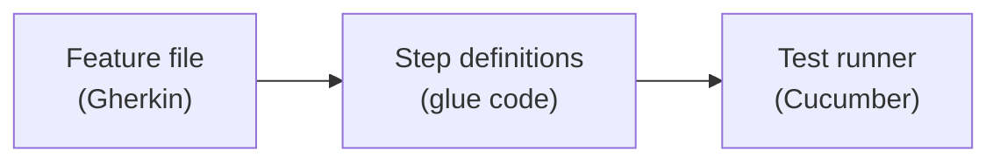
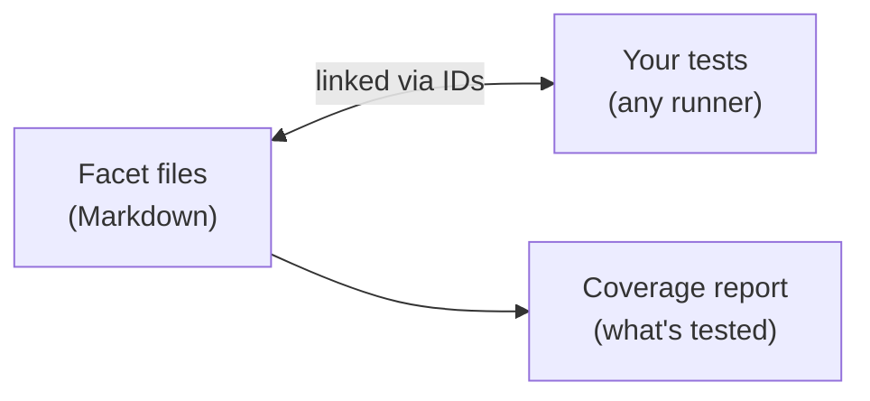
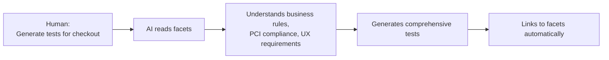

<div align="center">

# Facet Coverage

**Test every facet of your features**

*Natural specifications. Multiple perspectives. Rigorous coverage.*

[](https://www.npmjs.com/package/@facet-coverage/core)
[](https://opensource.org/licenses/MIT)
[](https://dl.circleci.com/pipelines/gh/iraycd/facet-coverage)
[](https://nodejs.org)

</div>

---

## Table of Contents

- [What is Facet?](#what-is-facet)
- [Why Facet?](#why-facet)
- [Installation](#installation)
- [Quick Start](#quick-start)
- [Linking Tests to Facets](#linking-tests-to-facets)
- [Project Structure](#project-structure)
- [CLI Commands](#cli-commands)
- [Playwright Integration](#playwright-integration)
- [Configuration](#configuration)
- [ID Patterns](#id-patterns)
- [Programmatic API](#programmatic-api)
- [Benefits](#benefits)
- [How Facet Differs](#how-facet-differs)
- [Key Principles](#key-principles)
- [Contributing](#contributing)
- [License](#license)

---

## What is Facet?

Facet is a modern testing framework that lets you document features from multiple stakeholder perspectives while maintaining exact traceability to your tests.

**One feature. Many facets.**

| Perspective | Description |
|-------------|-------------|
| **Business requirements** | Product owner specifications |
| **Compliance mandates** | Regulatory requirements (PCI-DSS, GDPR, etc.) |
| **UX standards** | Design system and accessibility rules |
| **Technical specs** | Architecture and API contracts |

All connected to the same tests. All tracked for coverage.

---

## Why Facet?

Traditional testing asks "what did developers test?" Facet asks "what do stakeholders need, and is it tested?"

Real products serve multiple stakeholders—product owners, compliance teams, UX designers, security architects—each with their own requirements. Facet lets every stakeholder write requirements in natural language, then tracks whether tests actually cover them. No Gherkin syntax. No translation layers. Just requirements linked to tests.

Read the full [Vision](VISION.md) to understand the philosophy behind multi-stakeholder coverage.

---

## Installation

```bash
bun add -d @facet-coverage/core
```

---

## Quick Start

### 1. Create Your First Facets

```bash
mkdir -p features/checkout/facets
```

Write in natural language:

**features/checkout/facets/business.md**
```markdown
## Guest Purchase Flow

A user who isn't logged in should be able to buy products. They add
items to cart, click checkout, provide email and payment details,
and get an order confirmation.

### Edge Cases
- Empty cart at checkout
- Invalid email format
- Payment gateway timeout
```

**features/checkout/facets/compliance.md**
```markdown
## PCI-DSS Payment Requirements

We handle credit card data, so PCI-DSS compliance is mandatory:

1. **Encryption in transit** - TLS 1.2+ required
2. **No CVV storage** - Use payment gateway, never store CVV
3. **Card masking** - Display only last 4 digits
```

### 2. Generate Structure & Types

```bash
bunx facet generate features/checkout/facets/
```

This creates two files in `features/checkout/.facet/`:
- `structure.json` - facet definitions
- `facets.ts` - TypeScript types for type-safe linking

**structure.json:**

```json
{
  "feature": "checkout",
  "facets": [
    {
      "id": "business:guest-purchase-flow",
      "source": {
        "file": "facets/business.md",
        "section": "guest-purchase-flow"
      },
      "type": "business"
    },
    {
      "id": "compliance:pci-dss-payment-requirements",
      "source": {
        "file": "facets/compliance.md",
        "section": "pci-dss-payment-requirements"
      },
      "type": "compliance"
    }
  ]
}
```

### 3. Link Tests

Import the generated types and use `facet()` in your tests:

```typescript
// features/checkout/tests/checkout.spec.ts
import { test, expect } from 'bun:test';  // or jest, vitest, mocha...
import { Facets, facet } from '../.facet/facets';

test('guest user completes purchase', () => {
  // Declare which facets this test covers
  facet(Facets.BUSINESS_GUEST_PURCHASE_FLOW);
  facet(Facets.COMPLIANCE_PCI_DSS_PAYMENT_REQUIREMENTS);

  // Your test code
  const order = checkout(cart, 'user@example.com', '4242...');
  expect(order.confirmed).toBe(true);
  expect(order.maskedCard).toBe('•••• 4242');  // PCI-DSS compliance
});
```

The `facet()` function is type-safe - TypeScript will error if you use an invalid facet ID!

### 4. Run Coverage

```bash
bunx facet analyze
```

**Output:**
```
Facet Coverage Report

Overall: 100%

By Type:
  business: 100% (1/1)
  compliance: 100% (1/1)

Reports generated:
  .facet-coverage/coverage.json
  .facet-coverage/coverage.html
  .facet-coverage/coverage.md
```

---

## Project Structure

```
project/
├── features/
│   ├── checkout/
│   │   ├── facets/
│   │   │   ├── business.md      # Product owner writes
│   │   │   ├── compliance.md    # Compliance team writes
│   │   │   └── ux.md            # UX designer writes
│   │   ├── .facet/
│   │   │   ├── structure.json   # Generated facet definitions
│   │   │   └── facets.ts        # Generated TypeScript types
│   │   └── tests/
│   │       └── checkout.spec.ts
│   │
│   └── authentication/
│       ├── facets/
│       ├── .facet/
│       └── tests/
│
├── .facet-coverage/              # Coverage reports
│   ├── coverage.json
│   ├── coverage.html
│   └── coverage.md
│
└── facet.config.js               # Configuration
```

---

## Linking Tests to Facets

Use the `facet()` function inside your tests - just like `expect()` but for coverage tracking!

### Recommended: Type-Safe with `facet()` Function

```typescript
import { test, expect } from 'bun:test';  // or jest, vitest, mocha...
import { Facets, facet } from '../.facet/facets';

test('guest user can complete a purchase', () => {
  // Declare which facets this test covers - type-safe with autocomplete!
  facet(Facets.BUSINESS_GUEST_PURCHASE_FLOW);
  facet(Facets.COMPLIANCE_PCI_DSS_PAYMENT_REQUIREMENTS);

  // Your test code
  const order = checkout(cart, email, card);
  expect(order.confirmed).toBe(true);
});

test('payment meets compliance', () => {
  // Multiple facets in one call
  facet(Facets.COMPLIANCE_PCI_DSS, Facets.COMPLIANCE_GDPR);

  expect(payment.encrypted).toBe(true);
});
```

**Benefits:**
- Full TypeScript autocomplete
- Compile-time validation (invalid facet IDs cause errors)
- Clean, readable syntax
- Works with any testing framework

**Generated `facets.ts` includes:**
- `FacetId` - Union type of all valid facet IDs
- `Facets` - Object with constants for each facet
- `facet()` - Type-safe function to declare coverage

### Alternative: Comment Annotations

For quick setup without imports, use comment annotations:

```typescript
// @facet business:guest-purchase-flow, compliance:pci-dss
test('guest user completes purchase', () => {
  // Your test code
});
```

### All Linking Methods

| Method | Type-Safe | Syntax |
|--------|-----------|--------|
| `facet()` function | Yes | `facet(Facets.ID)` inside test body |
| Comment annotation | No | `// @facet id` above test |
| Playwright annotation | Yes | `{ annotation: facet(...) }` in test options |

---

## CLI Commands

### Generate Structure & Types

```bash
# Generate from config (uses facetPattern - recommended)
bunx facet generate

# Generate from specific directory
bunx facet generate <facets-dir>

# Options
bunx facet generate features/checkout/facets/ -o ./custom-output  # Custom output dir
bunx facet generate features/checkout/facets/ -t business         # Override type
bunx facet generate --global                                      # Combined types at project root
bunx facet generate --no-types                                    # Skip TypeScript generation
bunx facet generate --quiet                                       # Suppress ID change warnings
```

**ID Change Detection:** When regenerating, facet warns if IDs have changed (renamed headings, removed sections). This helps catch breaking changes before they affect your tests. Use `--quiet` to suppress these warnings.

### Analyze Coverage

```bash
# Run coverage analysis
bunx facet analyze

# Options
bunx facet analyze -c facet.config.js    # Custom config
bunx facet analyze -f html               # Specific format
bunx facet analyze -t 80                 # Set threshold
bunx facet analyze --json                # JSON output for CI
bunx facet analyze --silent              # No console output
```

### Validate

```bash
# Validate structure and test links
bunx facet validate

# Options
bunx facet validate --strict    # Require all tests linked
bunx facet validate --json      # JSON output
```

### Watch Mode

```bash
# Re-run on changes
bunx facet watch

# Options
bunx facet watch -v    # Validate before analysis
```

---

## Playwright Integration

> **Note:** Playwright works with [comment annotations](#method-1-comment-annotations-any-framework) and [generated types](#method-2-type-safe-with-generated-types-recommended) out of the box. This section covers the **optional** enhanced integration with a custom reporter and annotation helper.

### Why Use the Playwright Integration?

- **Automatic coverage on test run** - Coverage reports generated after `playwright test`
- **Runtime annotation capture** - Works with dynamic test generation
- **Native annotation syntax** - Uses Playwright's built-in annotation system

### Reporter Setup

```typescript
// playwright.config.ts
import { FacetCoverageReporter } from '@facet-coverage/core/playwright';

export default {
  reporter: [
    ['html'],
    [FacetCoverageReporter, {
      output: {
        dir: '.facet-coverage',
        formats: ['json', 'html', 'markdown']
      },
      thresholds: {
        global: 80,
        byType: {
          compliance: 100
        }
      }
    }]
  ]
};
```

### Test Annotations

```typescript
import { test } from '@playwright/test';
import { facet } from '@facet-coverage/core/playwright';

// Single facet
test('my test', {
  annotation: facet('guest-checkout-flow')
}, async ({ page }) => {
  // ...
});

// Multiple facets
test('comprehensive test', {
  annotation: facet(
    'guest-checkout-flow',
    'pci-card-masking',
    'mobile-checkout-ux'
  )
}, async ({ page }) => {
  // ...
});
```

---

## Configuration

Facet Coverage supports multiple configuration file formats. The CLI looks for config files in this order:

1. `facet.config.js` (ESM or CommonJS)
2. `facet.config.mjs` (ESM only)
3. `facet.config.json` (JSON)

### Configuration Formats

**JavaScript (ESM):**

```javascript
// facet.config.js
export default {
  // Glob pattern(s) for finding facet markdown files
  facetPattern: ['features/**/*.facet.md', 'features/**/facets/*.md'],

  // Where structure files are generated
  structureFiles: ['features/**/.facet/structure.json'],

  // Where tests live
  testDir: './features/**/tests',
  testPatterns: ['**/*.spec.ts', '**/*.test.ts'],

  // Known facet types for Facets.CONSTANT resolution
  facetTypes: ['product', 'dx', 'technical', 'compliance', 'business', 'ux'],

  // Validation options
  validation: {
    requireSourceExists: true,
    requireSectionExists: true,
    requireAllTestsLinked: false
  },

  // Output options
  output: {
    dir: '.facet-coverage',
    formats: ['json', 'html', 'markdown']
  },

  // Coverage thresholds
  thresholds: {
    global: 75,
    byType: {
      compliance: 100,
      business: 80,
      ux: 70
    }
  }
};
```

**JSON:**

```json
{
  "facetPattern": ["features/**/*.facet.md", "features/**/facets/*.md"],
  "structureFiles": ["features/**/.facet/structure.json"],
  "testDir": "./features/**/tests",
  "testPatterns": ["**/*.spec.ts", "**/*.test.ts"],
  "facetTypes": ["product", "dx", "technical", "compliance", "business", "ux"],
  "validation": {
    "requireSourceExists": true,
    "requireSectionExists": true,
    "requireAllTestsLinked": false
  },
  "output": {
    "dir": ".facet-coverage",
    "formats": ["json", "html", "markdown"]
  },
  "thresholds": {
    "global": 75,
    "byType": {
      "compliance": 100
    }
  }
}
```

### Configuration Options

| Option | Type | Default | Description |
|--------|------|---------|-------------|
| `facetPattern` | `string \| string[]` | `['features/**/*.facet.md', 'features/**/facets/*.md']` | Glob pattern(s) for finding facet files |
| `structureFiles` | `string[]` | `['features/**/.facet/structure.json']` | Glob patterns for structure files |
| `testDir` | `string` | `'./features/**/tests'` | Test directory pattern |
| `testPatterns` | `string[]` | `['**/*.spec.ts', '**/*.test.ts']` | Test file patterns |
| `facetTypes` | `string[]` | `['product', 'dx', 'technical', ...]` | Known types for `Facets.CONSTANT` resolution |
| `validation.requireSourceExists` | `boolean` | `true` | Check if source files exist |
| `validation.requireSectionExists` | `boolean` | `true` | Check if sections exist in files |
| `validation.requireAllTestsLinked` | `boolean` | `false` | Require every test links to a facet |
| `output.dir` | `string` | `'.facet-coverage'` | Output directory for reports |
| `output.formats` | `string[]` | `['json', 'html', 'markdown']` | Report formats to generate |
| `thresholds.global` | `number` | `75` | Overall coverage threshold % |
| `thresholds.byType` | `object` | `{}` | Per-type coverage thresholds |

---

## ID Patterns

### Auto-Generated (Default)

```
Pattern: {filename}:{section-slug}

Examples:
- business:guest-purchase-flow
- compliance:pci-dss-payment-requirements
- ux:mobile-checkout-experience
```

### Explicit ID Anchors (Recommended for Stability)

Use explicit anchors to keep facet IDs stable when headings change:

```markdown
## Guest Purchase Flow {#guest-checkout}

When you rename the heading later, the ID stays the same:

## Complete Guest Checkout Experience {#guest-checkout}
```

This generates `business:guest-checkout` instead of deriving from the heading text.

**Why use explicit anchors?**
- IDs remain stable when you refactor documentation
- Tests don't break when headings are reworded
- Enables shorter, more readable IDs

### Nested Features (Hierarchical IDs)

For complex projects, organize features in nested directories:

```
features/
├── checkout/
│   ├── payments/
│   │   ├── facets/
│   │   │   └── compliance.md
│   │   └── .facet/
│   │       └── structure.json
```

This generates hierarchical IDs:

```
checkout/payments/compliance:pci-dss-requirements
```

Use in tests:

```typescript
facet(Facets.CHECKOUT_PAYMENTS_COMPLIANCE_PCI_DSS_REQUIREMENTS);
```

### Flexible Linking

```typescript
// All three formats work:
facet('guest-checkout-flow')                      // Custom slug
facet('business:guest-purchase-flow')             // Auto-generated
facet('facets/business.md#guest-purchase-flow')   // Direct path
```

---

## Programmatic API

```typescript
import {
  StructureReader,
  TestScanner,
  CoverageCalculator,
  Validator,
  JsonReporter,
  HtmlReporter,
  MarkdownReporter
} from '@facet-coverage/core';

// Read structures
const reader = new StructureReader();
const structures = await reader.readAllStructures();

// Scan tests
const scanner = new TestScanner();
const tests = await scanner.scanAllTests();

// Calculate coverage
const calculator = new CoverageCalculator();
const report = await calculator.calculateCoverage();

// Validate
const validator = new Validator();
const result = await validator.validate();

// Generate reports
const jsonReporter = new JsonReporter();
jsonReporter.write(report);

const htmlReporter = new HtmlReporter();
htmlReporter.write(report);

const mdReporter = new MarkdownReporter();
mdReporter.write(report);
```

---

## Benefits

<table>
<tr>
<td width="50%">

### For Product Owners
- Write in natural language
- Focus on business value
- See what's tested immediately
- Documentation evolves with product

### For Compliance Teams
- Direct regulation mapping
- Audit-ready traceability
- 100% coverage enforcement
- Automated compliance reports

### For UX Designers
- Document user flows naturally
- Link designs to tests
- Track accessibility coverage
- Mobile/desktop requirements clear

</td>
<td width="50%">

### For Developers
- One test covers multiple facets
- Clear requirements from all stakeholders
- Know exactly what's covered
- Easy maintenance

### For QA Teams
- Complete visibility
- Automated gap detection
- Multi-perspective coverage
- Progress tracking

</td>
</tr>
</table>

---

## How Facet Differs

| Approach | Focus | Facet's Difference |
|----------|-------|-------------------|
| **TDD** | Code correctness via unit tests | Facet tracks *what* is covered, not *how* to write code |
| **BDD** | Behavior via Given-When-Then | Facet uses free-form natural language, not structured syntax |
| **ATDD** | Acceptance criteria drive development | Facet maps multiple perspectives to tests, not just acceptance |
| **Traditional Coverage** | Lines/branches executed | Facet measures *requirement* coverage, not code coverage |

**Key insight:** TDD/BDD/ATDD are *development methodologies*. Facet is a *coverage framework*. Use them together.

### Facet vs Cucumber (and Similar BDD Tools)

Cucumber, SpecFlow, Behave, and similar tools follow a **specification-as-test** architecture where `.feature` files written in Gherkin syntax are directly executed as tests. Facet takes a fundamentally different approach: **specification-as-documentation**.

| Aspect | Cucumber / BDD Tools | Facet |
|--------|---------------------|-------|
| **Syntax** | Gherkin (Given-When-Then) | Free-form Markdown |
| **Specifications** | Are the tests (executable) | Are documentation (linked to tests) |
| **Step definitions** | Required for each step | Not needed - tests are regular code |
| **Learning curve** | Must learn Gherkin syntax | Write in natural language |
| **Perspectives** | Single specification file | Multiple facets per feature |
| **Test framework** | Cucumber runner | Any framework (Jest, Vitest, Playwright, etc.) |
| **Maintenance** | Step definitions can drift from specs | Direct linking prevents drift |

**Architectural difference illustrated:**

**Cucumber Approach:**


**Facet Approach:**


**Why this matters:**

1. **No translation layer** - Cucumber requires step definitions that translate Gherkin to code. These become a maintenance burden and can drift from specs. Facet links directly to existing tests.

2. **Use your existing tests** - With Cucumber, you rewrite tests in Gherkin. With Facet, you add `facet()` calls to tests you already have.

3. **Multiple perspectives** - A Cucumber feature file is one perspective. Facet lets business, compliance, UX, and technical teams each write their own facets for the same feature.

4. **Natural language freedom** - Gherkin's structured syntax (`Given`/`When`/`Then`) forces a specific format. Facet accepts any prose - bullet points, paragraphs, tables - whatever communicates best.

5. **Framework agnostic** - Cucumber requires the Cucumber test runner. Facet works with Jest, Vitest, Mocha, Playwright, or any testing framework.

**When to use Cucumber vs Facet:**

- **Cucumber**: When you want executable specifications and your team has invested in the Gherkin ecosystem
- **Facet**: When you want coverage tracking across multiple perspectives without changing how you write tests

### Why Facet Works for AI-Driven Testing

AI coding assistants excel at generating tests but struggle with *what to test*. Facet solves this:

- **Natural language specs** → AI understands requirements without parsing Gherkin
- **Multi-perspective facets** → AI generates tests covering business, compliance, UX in one pass
- **Type-safe linking** → AI can programmatically verify coverage completeness
- **Gap detection** → AI identifies untested facets and generates missing tests



Facet bridges human intent and AI execution with traceable, verifiable coverage.

---

## Key Principles

| Principle | Description |
|-----------|-------------|
| **Multi-Perspective** | Every feature has multiple facets |
| **Natural Language** | Write like humans, not machines |
| **Evolutionary** | Documentation grows with understanding |
| **Traceable** | Exact test-to-facet mapping |
| **Feature-Modular** | Self-contained, team-owned |
| **Lightweight** | Markdown + JSON, nothing heavy |
| **Flexible** | Adopt incrementally, customize freely |

---

## Contributing

Contributions are welcome! Please feel free to submit a Pull Request. For major changes, please open an issue first to discuss what you would like to change.

1. Fork the repository
2. Create your feature branch (`git checkout -b feature/amazing-feature`)
3. Commit your changes (`git commit -m 'Add some amazing feature'`)
4. Push to the branch (`git push origin feature/amazing-feature`)
5. Open a Pull Request

---

## License

MIT License - see the [LICENSE](LICENSE) file for details.

---

<div align="center">

**[Report Bug](https://github.com/iraycd/facet-coverage/issues) | [Request Feature](https://github.com/iraycd/facet-coverage/issues)**

If you find this project useful, please consider giving it a star!

</div>
